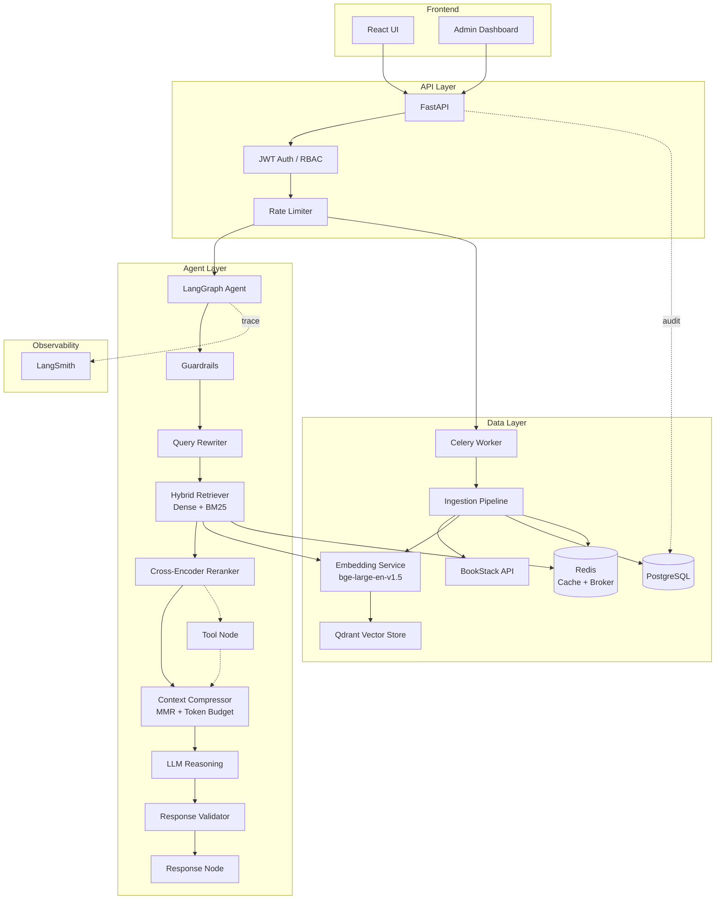
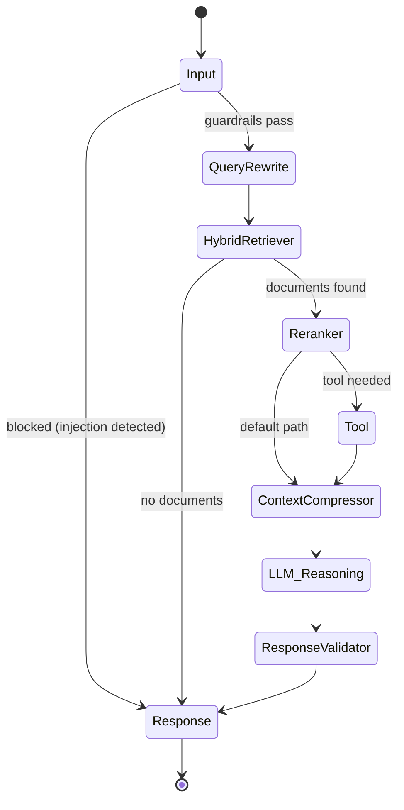
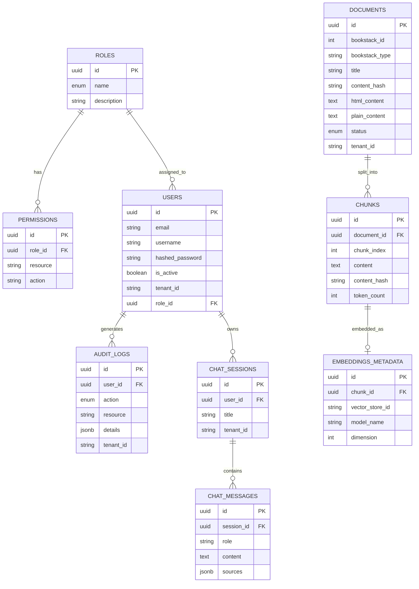

# BookStack RAG Agent

A production-grade AI agent system that ingests documentation from BookStack, processes it into a vector store, and provides intelligent Q&A through a LangGraph-powered RAG pipeline with full observability via LangSmith.

## Architecture



## Agent Workflow (LangGraph)



## Database Schema



## Project Structure

```
bookstack-rag-agent/
├── backend/
│   ├── app/
│   │   ├── api/              # FastAPI route handlers
│   │   │   ├── auth_routes.py
│   │   │   ├── ingestion_routes.py
│   │   │   ├── query_routes.py
│   │   │   ├── admin_routes.py
│   │   │   └── health_routes.py
│   │   ├── agents/           # LangGraph agent
│   │   │   ├── graph.py      # Graph definition, compilation & streaming
│   │   │   ├── nodes.py      # Node implementations (9-node pipeline)
│   │   │   ├── state.py      # Agent state schema
│   │   │   └── tools.py      # Tool registry & built-in tools
│   │   ├── auth/             # Authentication & RBAC
│   │   │   ├── dependencies.py
│   │   │   ├── jwt_handler.py
│   │   │   └── password.py
│   │   ├── core/             # Cross-cutting concerns
│   │   │   ├── cache.py      # Redis caching layer
│   │   │   ├── evaluation.py # Evaluation framework & metrics
│   │   │   ├── guardrails.py # Injection detection & output validation
│   │   │   ├── middleware.py
│   │   │   ├── observability.py
│   │   │   ├── logging_config.py
│   │   │   └── exceptions.py
│   │   ├── db/               # Database layer
│   │   │   ├── models.py     # SQLAlchemy ORM models
│   │   │   ├── session.py    # Async session management
│   │   │   └── seed.py       # Role/permission/admin seeder
│   │   ├── embeddings/       # Embedding generation
│   │   │   └── embedding_service.py
│   │   ├── ingestion/        # Data ingestion pipeline
│   │   │   ├── bookstack_client.py
│   │   │   ├── celery_app.py # Celery configuration
│   │   │   ├── content_parser.py
│   │   │   ├── chunker.py
│   │   │   ├── pipeline.py
│   │   │   └── tasks.py      # Celery tasks (async ingestion)
│   │   ├── retrieval/        # Vector search & reranking
│   │   │   ├── vector_store.py   # Qdrant + FAISS abstraction
│   │   │   └── retrieval_service.py  # Hybrid retrieval + cross-encoder
│   │   └── schemas/          # Pydantic request/response models
│   │       └── schemas.py
│   ├── alembic/              # Database migrations
│   │   ├── versions/         # Migration scripts
│   │   ├── env.py
│   │   └── script.py.mako
│   ├── main.py               # FastAPI app entrypoint
│   ├── config.py             # Settings from .env
│   └── requirements.txt
├── docker/
│   └── Dockerfile
├── scripts/
│   ├── seed_db.py
│   └── run_ingestion.py
├── docker-compose.yml
└── README.md
```

## Quick Start

### Prerequisites

- Python 3.12+
- PostgreSQL 16+
- Redis 7+
- Qdrant (included in Docker Compose)
- Docker & Docker Compose (recommended)

### Option 1: Docker Compose (Recommended)

```bash
# 1. Clone the repo
cd bookstack-rag-agent

# 2. Create .env from example
cp backend/.env.example backend/.env
# Edit backend/.env with your BookStack URL, API keys, etc.

# 3. Start all services (PostgreSQL, Redis, Qdrant, API, Celery worker)
docker-compose up -d

# 4. The API is now running at http://localhost:8001
# Swagger docs at http://localhost:8001/docs
# Qdrant dashboard at http://localhost:6333/dashboard
```

### Option 2: Local Development

```bash
# 1. Start PostgreSQL, Redis, and Qdrant
docker-compose up -d db redis qdrant

# 2. Create virtual environment
cd backend
python -m venv venv
source venv/bin/activate

# 3. Install dependencies
pip install -r requirements.txt

# 4. Set up environment
cp .env.example .env
# Edit .env with your settings

# 5. Start the API server
python main.py

# 6. In a separate terminal, start the Celery worker
celery -A app.ingestion.celery_app:celery_app worker --loglevel=info
```

### Initial Setup

```bash
# The database is auto-initialized and seeded on first startup.
# Default admin credentials:
#   username: admin
#   password: admin1234

# To run ingestion manually:
python scripts/run_ingestion.py
```

### Database Migrations

```bash
cd backend

# Generate a new migration after model changes
alembic revision --autogenerate -m "description of changes"

# Apply all pending migrations
alembic upgrade head

# Roll back one revision
alembic downgrade -1
```

## API Reference

### Authentication

| Method | Endpoint | Description | Auth |
|--------|----------|-------------|------|
| POST | `/api/v1/auth/login` | Login, get JWT tokens | No |
| POST | `/api/v1/auth/register` | Register new user | No |
| POST | `/api/v1/auth/refresh` | Refresh access token | No |

**Refresh token request** (body, not query param):
```json
{
  "refresh_token": "eyJhbGciOiJIUzI1NiIs..."
}
```
| GET | `/api/v1/auth/me` | Get current user | Yes |

### Query (RAG Agent)

| Method | Endpoint | Description | Auth | Roles |
|--------|----------|-------------|------|-------|
| POST | `/api/v1/query` | Submit query (standard response) | Yes | All |
| POST | `/api/v1/query/stream` | Submit query (SSE streaming) | Yes | All |

**Standard query request:**
```json
{
  "query": "How do I configure backups?",
  "top_k": 5,
  "session_id": null
}
```

**Standard query response:**
```json
{
  "answer": "Based on the documentation...",
  "sources": [
    {
      "chunk_id": "...",
      "document_title": "Backup Configuration",
      "content": "...",
      "score": 0.92
    }
  ],
  "session_id": "uuid",
  "latency_ms": 1234.5,
  "metadata": {
    "rewritten_query": "configure automated backup schedule",
    "grounding_confidence": 0.87,
    "cached": false
  }
}
```

**Streaming response** (`/api/v1/query/stream`) returns Server-Sent Events:
```
data: {"node": "query_rewrite", "answer": null, "sources": [], "metadata": {}}

data: {"node": "hybrid_retriever", "answer": null, "sources": [...], "metadata": {}}

data: {"node": "response", "answer": "Based on the documentation...", "sources": [...], "metadata": {...}}

data: [DONE]
```

### Ingestion

| Method | Endpoint | Description | Auth | Roles |
|--------|----------|-------------|------|-------|
| POST | `/api/v1/ingestion/ingest` | Enqueue ingestion job (Celery) | Yes | Admin, Developer |
| GET | `/api/v1/ingestion/status/{task_id}` | Poll Celery task status | Yes | Admin, Developer |
| GET | `/api/v1/ingestion/documents` | List ingested documents | Yes | Admin, Developer |

**Ingest response:**
```json
{
  "task_id": "celery-uuid",
  "status": "queued",
  "message": "Ingestion job enqueued"
}
```

**Status response:**
```json
{
  "task_id": "celery-uuid",
  "status": "SUCCESS",
  "result": {"pages_processed": 42, "chunks_created": 318}
}
```

### Admin

| Method | Endpoint | Description | Auth | Roles |
|--------|----------|-------------|------|-------|
| GET | `/api/v1/admin/metrics` | System metrics | Yes | Admin |
| GET | `/api/v1/admin/users` | List users | Yes | Admin |
| PATCH | `/api/v1/admin/users/{id}` | Update user | Yes | Admin |
| POST | `/api/v1/admin/evaluate` | Run evaluation suite | Yes | Admin |
| GET | `/api/v1/admin/cache/health` | Redis cache health | Yes | Admin |

**Evaluation response:**
```json
{
  "pass_rate": 0.8,
  "avg_latency_ms": 1450.2,
  "avg_grounding_confidence": 0.83,
  "retrieval_accuracy": 0.9,
  "total_cases": 5,
  "passed": 4
}
```

### Health

| Method | Endpoint | Description | Auth |
|--------|----------|-------------|------|
| GET | `/health` | Basic liveness check | No |
| GET | `/health/detailed` | Full subsystem health (DB, Redis, Qdrant) | No |

## RBAC Model

| Role | Ingestion | Query | Admin | User Mgmt |
|------|-----------|-------|-------|-----------|
| Admin | ✅ Read/Write/Delete | ✅ Read/Write | ✅ Read/Write/Delete | ✅ Read/Write/Delete |
| Developer | ✅ Read/Write | ✅ Read/Write | ✅ Read | ✅ Read |
| User | ❌ | ✅ Read/Write | ❌ | ❌ |

## LangGraph Pipeline (9 Nodes)

| # | Node | Role |
|---|------|------|
| 1 | **Input** | Query validation + prompt injection check via guardrails |
| 2 | **Query Rewriter** | LLM-based query expansion/clarification (0-shot, 256 tokens) |
| 3 | **Hybrid Retriever** | Parallel dense (Qdrant) + keyword (BM25) search merged via RRF |
| 4 | **Reranker** | `BAAI/bge-reranker-large` cross-encoder batch scoring |
| 5 | **Tool** | Extensible tool invocation (wired, passthrough by default) |
| 6 | **Context Compressor** | Dedup → MMR diversity selection → token-budget trimming |
| 7 | **LLM Reasoning** | GPT-4o generation over compressed context |
| 8 | **Response Validator** | Source enforcement + word-overlap grounding check |
| 9 | **Response** | Final answer with latency, grounding confidence metadata |

### Hybrid Retrieval — RRF Fusion

Dense and keyword results are merged using **Reciprocal Rank Fusion** (k=60):

$$score_{rrf}(d) = w_{dense} \cdot \frac{1}{k + rank_{dense}(d)} + w_{sparse} \cdot \frac{1}{k + rank_{sparse}(d)}$$

Default weights: `DENSE_WEIGHT=0.7`, `BM25_WEIGHT=0.3`. Both are configurable.

### Context Compression — MMR

After reranking, **Max Marginal Relevance** selects a diverse subset:

$$MMR = \arg\max_{d_i \in R \setminus S} \left[ \lambda \cdot sim(d_i, q) - (1 - \lambda) \cdot \max_{d_j \in S} sim(d_i, d_j) \right]$$

Default `MMR_LAMBDA=0.7`. Results are then trimmed to `MAX_CONTEXT_TOKENS=4096`.

## LangSmith Observability

Every query is fully traced through LangSmith with `@traceable` decorators on all nodes:

1. **Input Node** — query validation and injection check
2. **Query Rewriter Node** — rewritten query logged
3. **Hybrid Retriever Node** — dense + keyword result counts and scores
4. **Reranker Node** — cross-encoder scores pre/post sort
5. **Context Compressor Node** — token counts before/after trim
6. **LLM Reasoning Node** — full prompt, context, and response
7. **Response Validator Node** — grounding confidence score
8. **Response Node** — final formatting and latency

Set `LANGSMITH_API_KEY` and `LANGCHAIN_TRACING_V2=true` in your `.env` to enable.

View traces at https://smith.langchain.com

## Frontend Specification (React)

### Admin Dashboard

```
┌─────────────────────────────────────────────┐
│  BookStack RAG Admin                   [≡]  │
├──────────┬──────────────────────────────────┤
│          │  Dashboard                       │
│ Dashboard│  ┌────────┐ ┌────────┐ ┌───────┐│
│ Users    │  │Docs:247│ │Chunks: │ │Users: ││
│ Ingest   │  │        │ │  1,892 │ │   14  ││
│ Metrics  │  └────────┘ └────────┘ └───────┘│
│          │                                  │
│          │  Recent Queries          [chart] │
│          │  ┌──────────────────────────────┐│
│          │  │ Latency over time    ▂▅▇▅▃▂ ││
│          │  └──────────────────────────────┘│
│          │                                  │
│          │  Ingestion Status                │
│          │  ┌──────────────────────────────┐│
│          │  │ ● Completed: 230            ││
│          │  │ ○ Processing: 12            ││
│          │  │ ✕ Failed: 5                 ││
│          │  └──────────────────────────────┘│
└──────────┴──────────────────────────────────┘
```

**Pages:**
- **Dashboard**: KPI cards, query latency chart, ingestion status
- **Users**: Table with role management, activate/deactivate
- **Ingestion**: Trigger ingestion, view document list, filter by status
- **Metrics**: Query count, avg latency, documents by status

### Chat Interface

```
┌─────────────────────────────────────────────┐
│  BookStack RAG Chat                    [⚙]  │
├──────────┬──────────────────────────────────┤
│          │                                  │
│ Sessions │  ┌──────────────────────────────┐│
│ ─────── │  │ How do I configure backups?  ││
│ > Config │  └──────────────────────────────┘│
│   Backup │                                  │
│   Deploy │  ┌──────────────────────────────┐│
│          │  │ Based on the documentation,  ││
│          │  │ you can configure backups    ││
│          │  │ by...                        ││
│          │  │                              ││
│          │  │ Sources:                     ││
│          │  │ 📄 Backup Configuration      ││
│          │  │ 📄 Server Admin Guide        ││
│          │  └──────────────────────────────┘│
│          │                                  │
│          │  ┌─────────────────────┐ [Send]  │
│          │  │ Type your question… │         │
│          │  └─────────────────────┘         │
└──────────┴──────────────────────────────────┘
```

**Features:**
- Session sidebar with history
- Streaming response display
- Source document cards with relevance scores
- Markdown rendering for responses
- Chat session persistence

### Tech Stack (Frontend)

- **Framework**: React 18+ with TypeScript (strict mode)
- **State**: TanStack Query v5 (server state) + React Context (UI state)
- **UI**: Tailwind CSS + shadcn/ui + Lucide icons
- **Routing**: React Router v6 with lazy-loaded routes
- **Streaming**: SSE via fetch + ReadableStream (with POST fallback)
- **Auth**: JWT stored in localStorage (access + refresh tokens)
- **Markdown**: react-markdown + rehype-sanitize + rehype-highlight
- **Performance**: @tanstack/react-virtual (message virtualization), React.memo

See [LOVABLE_PROMPT.md](LOVABLE_PROMPT.md) for the complete frontend specification.

## Environment Variables

### Core

| Variable | Description | Default |
|----------|-------------|---------|
| `DATABASE_URL` | PostgreSQL async connection string | `postgresql+asyncpg://...` |
| `JWT_SECRET_KEY` | Secret for JWT signing | — |
| `OPENAI_API_KEY` | OpenAI API key for LLM | — |
| `LLM_MODEL` | LLM model name | `gpt-4o` |

### BookStack

| Variable | Description | Default |
|----------|-------------|---------|
| `BOOKSTACK_BASE_URL` | BookStack instance URL | — |
| `BOOKSTACK_TOKEN_ID` | BookStack API token ID | — |
| `BOOKSTACK_TOKEN_SECRET` | BookStack API token secret | — |

### Embeddings & Retrieval

| Variable | Description | Default |
|----------|-------------|---------|
| `EMBEDDING_MODEL` | Sentence transformer model | `BAAI/bge-large-en-v1.5` |
| `RERANKER_MODEL` | Cross-encoder reranker model | `BAAI/bge-reranker-large` |
| `RERANKER_BATCH_SIZE` | Cross-encoder batch size | `16` |
| `TOP_K_RETRIEVAL` | Documents fetched before reranking | `20` |
| `DENSE_WEIGHT` | RRF weight for dense retrieval | `0.7` |
| `BM25_WEIGHT` | RRF weight for keyword retrieval | `0.3` |

### Vector Store (Qdrant)

| Variable | Description | Default |
|----------|-------------|---------|
| `VECTOR_STORE_TYPE` | `qdrant` or `faiss` | `qdrant` |
| `QDRANT_HOST` | Qdrant server hostname | `localhost` |
| `QDRANT_PORT` | Qdrant gRPC/HTTP port | `6333` |
| `QDRANT_COLLECTION` | Qdrant collection name | `bookstack_chunks` |
| `QDRANT_API_KEY` | Qdrant API key (cloud only) | — |

### Redis & Caching

| Variable | Description | Default |
|----------|-------------|---------|
| `REDIS_URL` | Redis connection URL | `redis://localhost:6379/0` |
| `CACHE_ENABLED` | Enable query/retrieval caching | `true` |
| `CACHE_QUERY_TTL` | Query cache TTL (seconds) | `600` |
| `CACHE_RETRIEVAL_TTL` | Retrieval cache TTL (seconds) | `300` |

### Celery

| Variable | Description | Default |
|----------|-------------|---------|
| `CELERY_BROKER_URL` | Celery broker (Redis) | `redis://localhost:6379/1` |
| `CELERY_RESULT_BACKEND` | Celery result backend (Redis) | `redis://localhost:6379/2` |

### CORS

| Variable | Description | Default |
|----------|-------------|---------|
| `ALLOWED_ORIGINS` | Comma-separated allowed origins (used when `DEBUG=false`) | `http://localhost:5173,http://localhost:3000` |

### Guardrails

| Variable | Description | Default |
|----------|-------------|---------|
| `GUARDRAILS_ENABLED` | Enable injection detection & output validation | `true` |
| `MIN_SUPPORTING_CHUNKS` | Minimum source chunks required | `1` |
| `HALLUCINATION_THRESHOLD` | Grounding word-overlap threshold (0–1) | `0.5` |

### Context & Streaming

| Variable | Description | Default |
|----------|-------------|---------|
| `MAX_CONTEXT_TOKENS` | Max tokens passed to LLM | `4096` |
| `MMR_LAMBDA` | MMR relevance/diversity trade-off | `0.7` |
| `STREAMING_ENABLED` | Enable SSE streaming endpoint | `true` |

### Observability

| Variable | Description | Default |
|----------|-------------|---------|
| `LANGSMITH_API_KEY` | LangSmith API key | — |
| `LANGCHAIN_TRACING_V2` | Enable LangSmith tracing | `true` |
| `LANGCHAIN_PROJECT` | LangSmith project name | `bookstack-rag` |

## Performance

- **Hybrid search**: Dense (Qdrant ANN) + keyword (text index) merged via RRF — higher recall than single-strategy retrieval
- **Cross-encoder reranking**: `bge-reranker-large` significantly improves precision over cosine similarity
- **MMR context compression**: Reduces context size while maximising diversity; trims to token budget before LLM call
- **Two-tier Redis cache**: Query results cached for 10 min, retrieval results for 5 min; cache key is `SHA-256(query + tenant_id)`
- **Celery ingestion queue**: Ingestion jobs run in separate workers with `acks_late=True` and 3-retry exponential backoff
- **Embedding caching**: LRU in-process cache (10K entries) avoids re-encoding seen chunks
- **Batch embedding**: Processes up to 32 texts per batch on GPU/CPU
- **Singleton models**: Embedding and reranker models loaded once, shared across requests
- **Async DB**: All database operations use async SQLAlchemy with connection pooling

## Security

- JWT authentication with access + refresh tokens (body-based refresh)
- RBAC with role-based permission checks on every endpoint
- **CORS**: Allows all origins in DEBUG mode; restricts to `ALLOWED_ORIGINS` in production
- **Email validation**: EmailStr (Pydantic) on registration
- **Prompt injection detection** — 11 regex patterns block adversarial inputs before agent execution
- **Output grounding validation** — word-overlap check flags low-confidence answers; fallback response returned
- **Source enforcement** — responses require at least `MIN_SUPPORTING_CHUNKS` retrieved sources
- Tenant isolation (`tenant_id` filtering across PostgreSQL and Qdrant)
- Rate limiting via SlowAPI
- Input validation via Pydantic schemas
- Content hash deduplication prevents redundant processing
- Audit logging for all sensitive operations

## Guardrails

The guardrails layer (`app/core/guardrails.py`) runs at two points in the pipeline:

1. **Pre-execution** (Input Node): detects prompt injection attempts using compiled regex patterns. Blocked queries never reach the LLM.
2. **Post-generation** (Response Validator Node): checks that the generated answer is grounded in retrieved sources. If grounding confidence falls below `HALLUCINATION_THRESHOLD`, a safe fallback response is returned instead.

Disable for trusted internal environments: `GUARDRAILS_ENABLED=false`.

## Evaluation

Run the built-in evaluation suite against a 5-case default dataset:

```bash
curl -X POST http://localhost:8001/api/v1/admin/evaluate \
  -H "Authorization: Bearer <admin_token>"
```

Metrics reported:
- **Pass rate** — % of cases where answer contains expected keywords
- **Average latency** — mean end-to-end latency in ms
- **Average grounding confidence** — mean word-overlap score
- **Retrieval accuracy** — % of cases where a relevant source was retrieved

All evaluation runs are traced to LangSmith under the project name configured in `LANGCHAIN_PROJECT`.

## License

MIT
