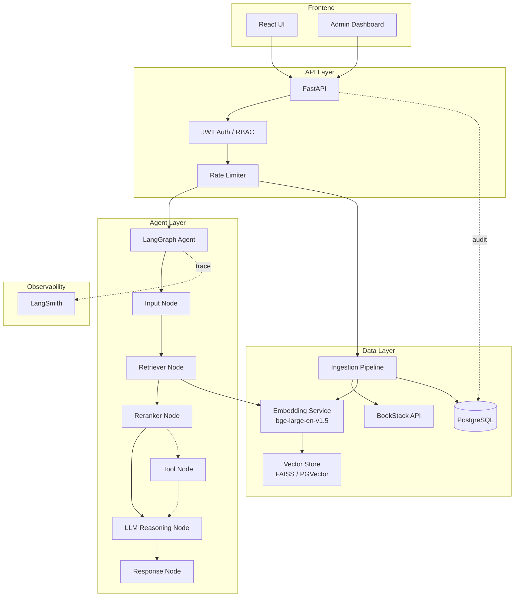
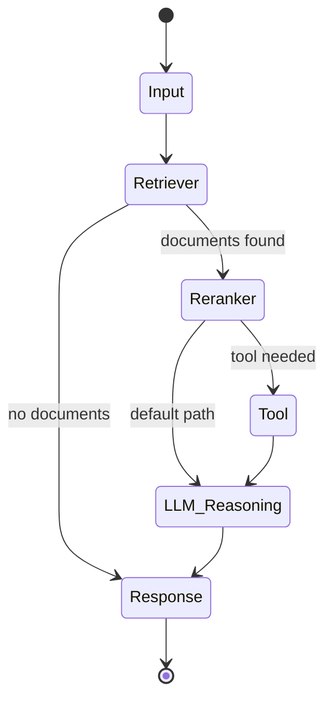
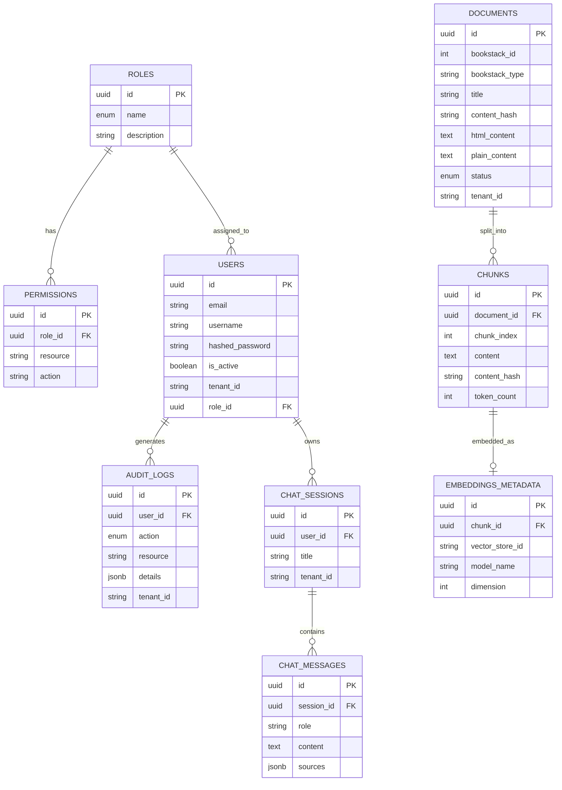

# BookStack RAG Agent

A production-grade AI agent system that ingests documentation from BookStack, processes it into a vector store, and provides intelligent Q&A through a LangGraph-powered RAG pipeline with full observability via LangSmith.

## Architecture



## Agent Workflow (LangGraph)



## Database Schema



## Project Structure

```
bookstack-rag-agent/
├── backend/
│   ├── app/
│   │   ├── api/              # FastAPI route handlers
│   │   │   ├── auth_routes.py
│   │   │   ├── ingestion_routes.py
│   │   │   ├── query_routes.py
│   │   │   ├── admin_routes.py
│   │   │   └── health_routes.py
│   │   ├── agents/           # LangGraph agent
│   │   │   ├── graph.py      # Graph definition & compilation
│   │   │   ├── nodes.py      # Node implementations
│   │   │   └── state.py      # Agent state schema
│   │   ├── auth/             # Authentication & RBAC
│   │   │   ├── dependencies.py
│   │   │   ├── jwt_handler.py
│   │   │   └── password.py
│   │   ├── core/             # Cross-cutting concerns
│   │   │   ├── middleware.py
│   │   │   ├── observability.py
│   │   │   ├── logging_config.py
│   │   │   └── exceptions.py
│   │   ├── db/               # Database layer
│   │   │   ├── models.py     # SQLAlchemy ORM models
│   │   │   ├── session.py    # Async session management
│   │   │   └── seed.py       # Role/permission/admin seeder
│   │   ├── embeddings/       # Embedding generation
│   │   │   └── embedding_service.py
│   │   ├── ingestion/        # Data ingestion pipeline
│   │   │   ├── bookstack_client.py
│   │   │   ├── content_parser.py
│   │   │   ├── chunker.py
│   │   │   └── pipeline.py
│   │   ├── retrieval/        # Vector search & reranking
│   │   │   ├── vector_store.py
│   │   │   └── retrieval_service.py
│   │   └── schemas/          # Pydantic request/response models
│   │       └── schemas.py
│   ├── alembic/              # Database migrations
│   ├── main.py               # FastAPI app entrypoint
│   ├── config.py             # Settings from .env
│   └── requirements.txt
├── docker/
│   └── Dockerfile
├── scripts/
│   ├── seed_db.py
│   └── run_ingestion.py
├── docker-compose.yml
└── README.md
```

## Quick Start

### Prerequisites

- Python 3.12+
- PostgreSQL 16+
- Redis
- Docker & Docker Compose (recommended)

### Option 1: Docker Compose (Recommended)

```bash
# 1. Clone the repo
cd bookstack-rag-agent

# 2. Create .env from example
cp backend/.env.example backend/.env
# Edit backend/.env with your BookStack URL, API keys, etc.

# 3. Start all services
docker-compose up -d

# 4. The API is now running at http://localhost:8000
# Swagger docs at http://localhost:8000/docs
```

### Option 2: Local Development

```bash
# 1. Start PostgreSQL and Redis
# (use Docker or install locally)
docker-compose up -d db redis

# 2. Create virtual environment
cd backend
python -m venv venv
source venv/bin/activate

# 3. Install dependencies
pip install -r requirements.txt

# 4. Set up environment
cp .env.example .env
# Edit .env with your settings

# 5. Run the app
python main.py
```

### Initial Setup

```bash
# The database is auto-initialized and seeded on first startup.
# Default admin credentials:
#   username: admin
#   password: admin1234

# To run ingestion manually:
python scripts/run_ingestion.py
```

## API Reference

### Authentication

| Method | Endpoint | Description | Auth |
|--------|----------|-------------|------|
| POST | `/api/v1/auth/login` | Login, get JWT tokens | No |
| POST | `/api/v1/auth/register` | Register new user | No |
| POST | `/api/v1/auth/refresh` | Refresh access token | No |
| GET | `/api/v1/auth/me` | Get current user | Yes |

### Query (RAG Agent)

| Method | Endpoint | Description | Auth | Roles |
|--------|----------|-------------|------|-------|
| POST | `/api/v1/query` | Submit query to RAG agent | Yes | All |

**Request:**
```json
{
  "query": "How do I configure backups?",
  "top_k": 5,
  "session_id": null
}
```

**Response:**
```json
{
  "answer": "Based on the documentation...",
  "sources": [
    {
      "chunk_id": "...",
      "document_title": "Backup Configuration",
      "content": "...",
      "score": 0.92
    }
  ],
  "session_id": "uuid",
  "latency_ms": 1234.5
}
```

### Ingestion

| Method | Endpoint | Description | Auth | Roles |
|--------|----------|-------------|------|-------|
| POST | `/api/v1/ingestion/ingest` | Start ingestion | Yes | Admin, Developer |
| GET | `/api/v1/ingestion/documents` | List documents | Yes | Admin, Developer |

### Admin

| Method | Endpoint | Description | Auth | Roles |
|--------|----------|-------------|------|-------|
| GET | `/api/v1/admin/metrics` | System metrics | Yes | Admin |
| GET | `/api/v1/admin/users` | List users | Yes | Admin |
| PATCH | `/api/v1/admin/users/{id}` | Update user | Yes | Admin |

## RBAC Model

| Role | Ingestion | Query | Admin | User Mgmt |
|------|-----------|-------|-------|-----------|
| Admin | ✅ Read/Write/Delete | ✅ Read/Write | ✅ Read/Write/Delete | ✅ Read/Write/Delete |
| Developer | ✅ Read/Write | ✅ Read/Write | ✅ Read | ✅ Read |
| User | ❌ | ✅ Read/Write | ❌ | ❌ |

## LangSmith Observability

Every query is fully traced through LangSmith:

1. **Input Node** — query validation and preprocessing
2. **Retriever Node** — vector similarity search with timing
3. **Reranker Node** — document reranking with scores
4. **LLM Reasoning Node** — full prompt, context, and response
5. **Response Node** — final formatting and latency

Set `LANGSMITH_API_KEY` and `LANGCHAIN_TRACING_V2=true` in your `.env` to enable.

View traces at https://smith.langchain.com

## Frontend Specification (React)

### Admin Dashboard

```
┌─────────────────────────────────────────────┐
│  BookStack RAG Admin                   [≡]  │
├──────────┬──────────────────────────────────┤
│          │  Dashboard                       │
│ Dashboard│  ┌────────┐ ┌────────┐ ┌───────┐│
│ Users    │  │Docs:247│ │Chunks: │ │Users: ││
│ Ingest   │  │        │ │  1,892 │ │   14  ││
│ Metrics  │  └────────┘ └────────┘ └───────┘│
│          │                                  │
│          │  Recent Queries          [chart] │
│          │  ┌──────────────────────────────┐│
│          │  │ Latency over time    ▂▅▇▅▃▂ ││
│          │  └──────────────────────────────┘│
│          │                                  │
│          │  Ingestion Status                │
│          │  ┌──────────────────────────────┐│
│          │  │ ● Completed: 230            ││
│          │  │ ○ Processing: 12            ││
│          │  │ ✕ Failed: 5                 ││
│          │  └──────────────────────────────┘│
└──────────┴──────────────────────────────────┘
```

**Pages:**
- **Dashboard**: KPI cards, query latency chart, ingestion status
- **Users**: Table with role management, activate/deactivate
- **Ingestion**: Trigger ingestion, view document list, filter by status
- **Metrics**: Query count, avg latency, documents by status

### Chat Interface

```
┌─────────────────────────────────────────────┐
│  BookStack RAG Chat                    [⚙]  │
├──────────┬──────────────────────────────────┤
│          │                                  │
│ Sessions │  ┌──────────────────────────────┐│
│ ─────── │  │ How do I configure backups?  ││
│ > Config │  └──────────────────────────────┘│
│   Backup │                                  │
│   Deploy │  ┌──────────────────────────────┐│
│          │  │ Based on the documentation,  ││
│          │  │ you can configure backups    ││
│          │  │ by...                        ││
│          │  │                              ││
│          │  │ Sources:                     ││
│          │  │ 📄 Backup Configuration      ││
│          │  │ 📄 Server Admin Guide        ││
│          │  └──────────────────────────────┘│
│          │                                  │
│          │  ┌─────────────────────┐ [Send]  │
│          │  │ Type your question… │         │
│          │  └─────────────────────┘         │
└──────────┴──────────────────────────────────┘
```

**Features:**
- Session sidebar with history
- Streaming response display
- Source document cards with relevance scores
- Markdown rendering for responses
- Chat session persistence

### Tech Stack (Frontend)

- **Framework**: React 18+ with TypeScript
- **State**: Zustand or TanStack Query
- **UI**: Tailwind CSS + shadcn/ui
- **Routing**: React Router v6
- **Streaming**: Server-Sent Events (SSE) or WebSocket
- **Auth**: JWT stored in httpOnly cookies

## Environment Variables

| Variable | Description | Default |
|----------|-------------|---------|
| `DATABASE_URL` | PostgreSQL async connection string | `postgresql+asyncpg://...` |
| `BOOKSTACK_BASE_URL` | BookStack instance URL | — |
| `BOOKSTACK_TOKEN_ID` | BookStack API token ID | — |
| `BOOKSTACK_TOKEN_SECRET` | BookStack API token secret | — |
| `OPENAI_API_KEY` | OpenAI API key for LLM | — |
| `LLM_MODEL` | LLM model name | `gpt-4o` |
| `EMBEDDING_MODEL` | Sentence transformer model | `BAAI/bge-large-en-v1.5` |
| `VECTOR_STORE_TYPE` | `faiss` or `pgvector` | `faiss` |
| `JWT_SECRET_KEY` | Secret for JWT signing | — |
| `LANGSMITH_API_KEY` | LangSmith API key | — |
| `LANGCHAIN_TRACING_V2` | Enable LangSmith tracing | `true` |
| `REDIS_URL` | Redis connection URL | `redis://localhost:6379/0` |

## Performance

- **Embedding caching**: LRU cache (10K entries) avoids re-encoding seen chunks
- **Batch embedding**: Processes up to 32 texts per batch on GPU/CPU
- **Singleton model**: Embedding model loaded once, shared across requests
- **Async DB**: All database operations use async SQLAlchemy
- **Background ingestion**: Ingestion runs in FastAPI background tasks
- **Connection pooling**: SQLAlchemy pool with pre-ping health checks

## Security

- JWT authentication with access + refresh tokens
- RBAC with role-based permission checks on every endpoint
- Tenant isolation (multi-tenant `tenant_id` filtering)
- Rate limiting via SlowAPI
- Input validation via Pydantic schemas
- Content hash deduplication prevents redundant processing
- Audit logging for all sensitive operations

## License

MIT
