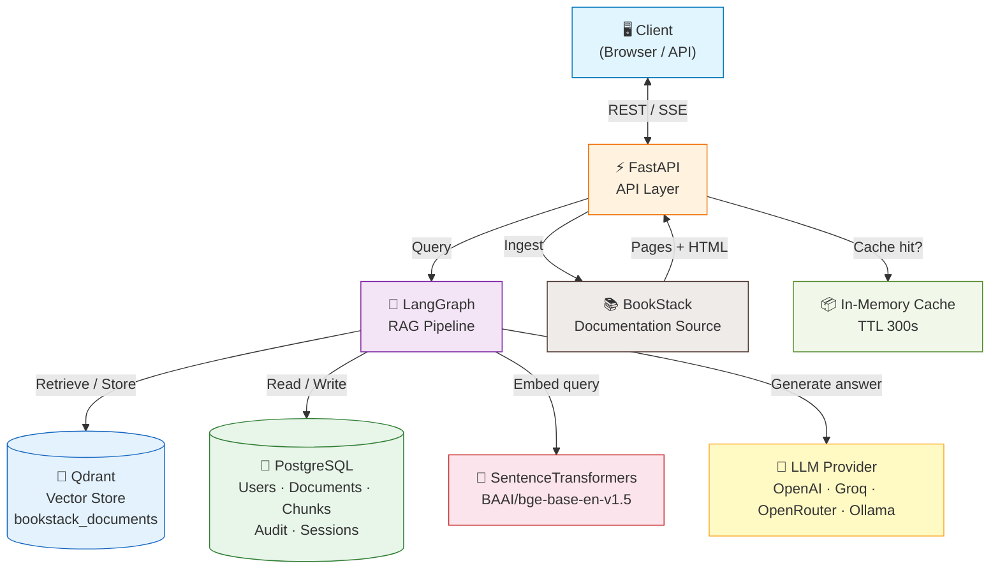
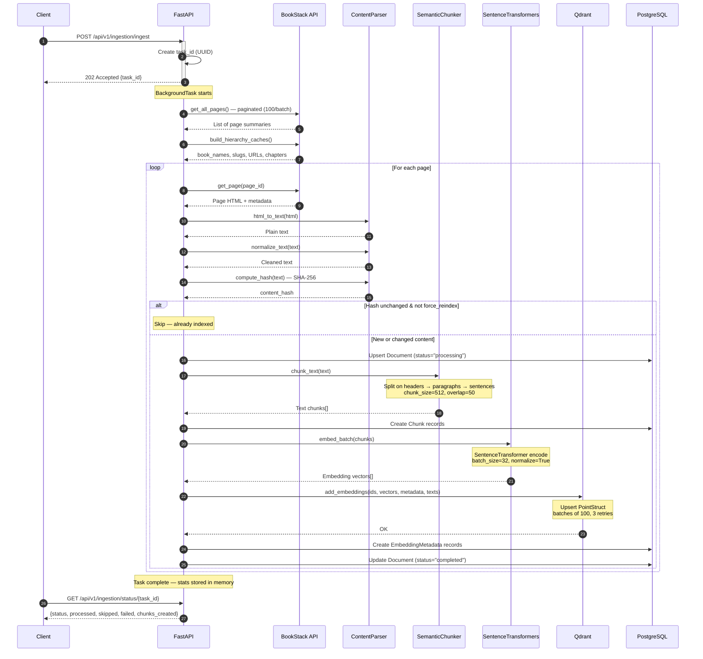
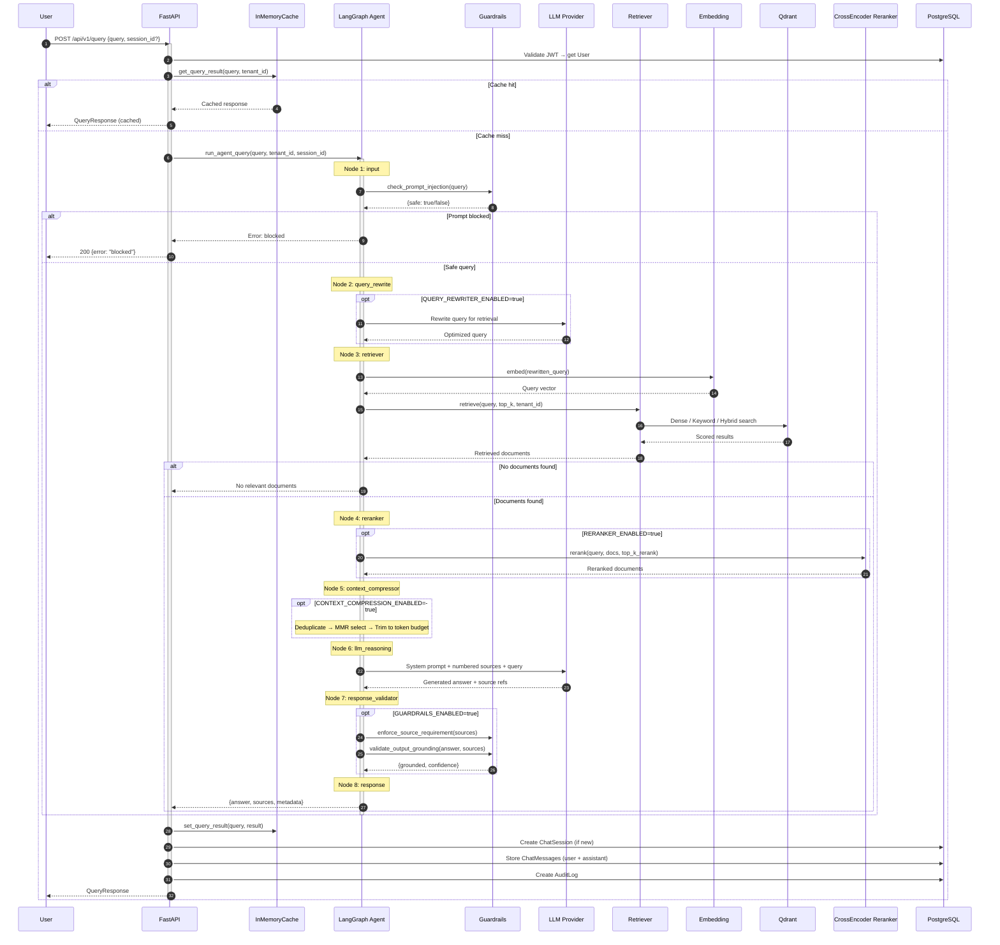
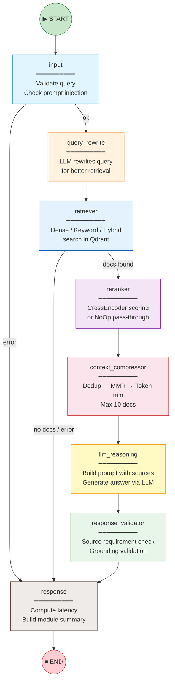
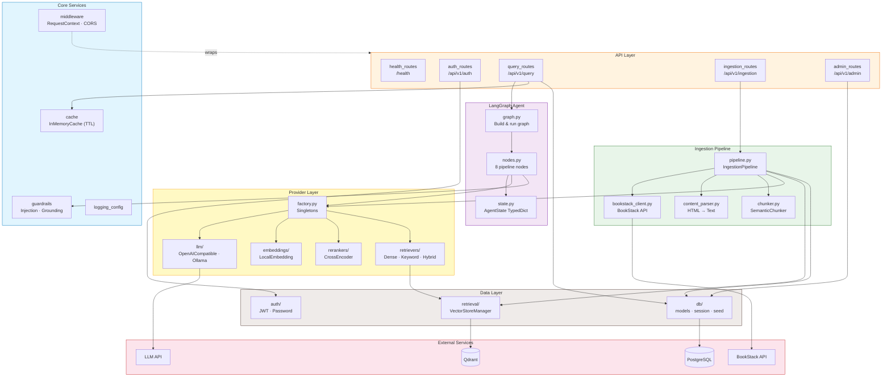
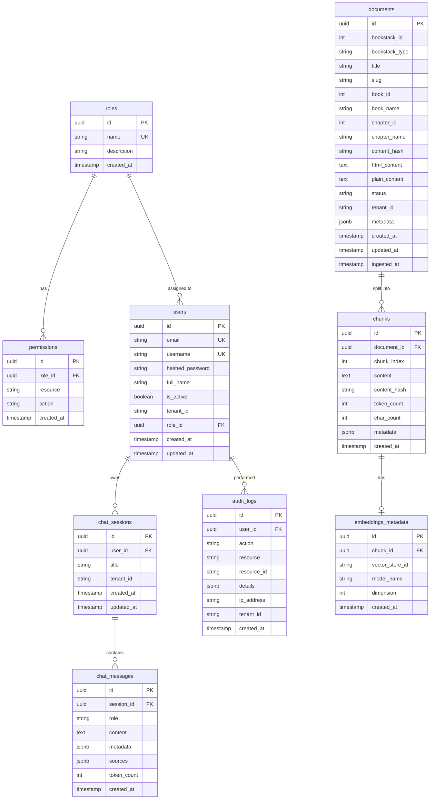
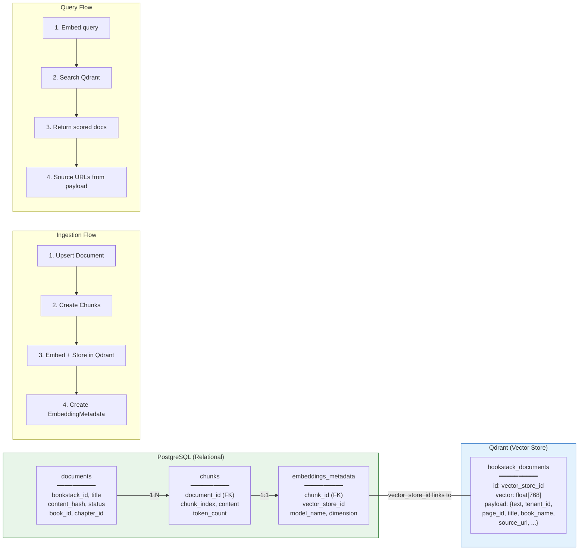
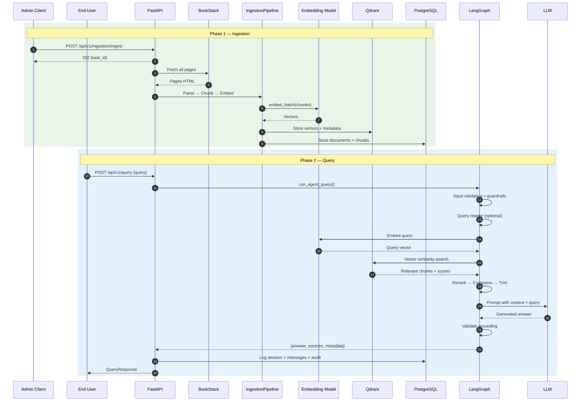
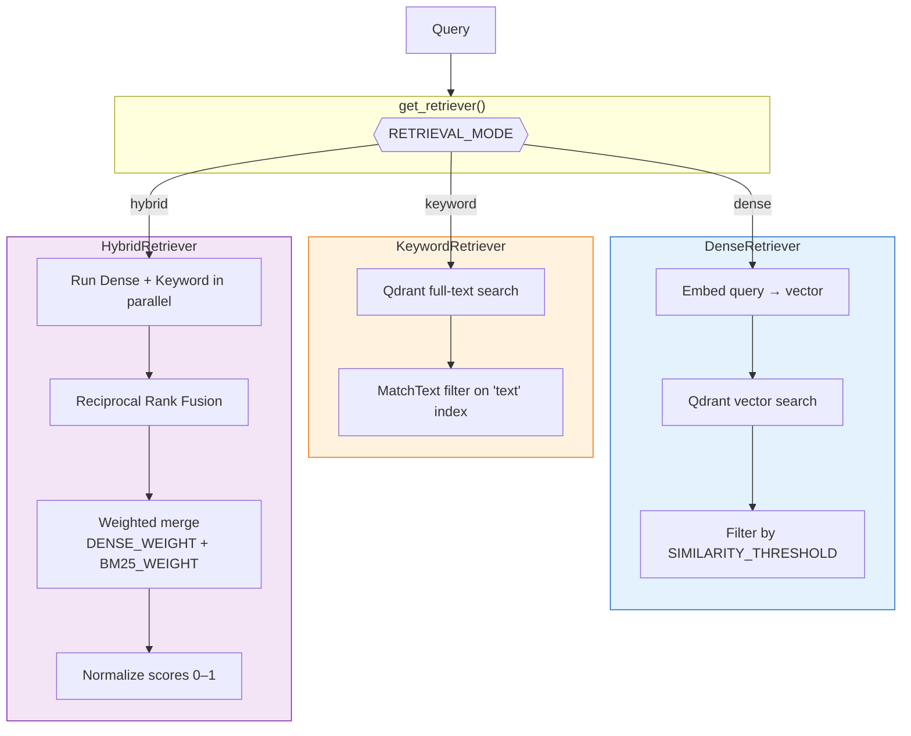
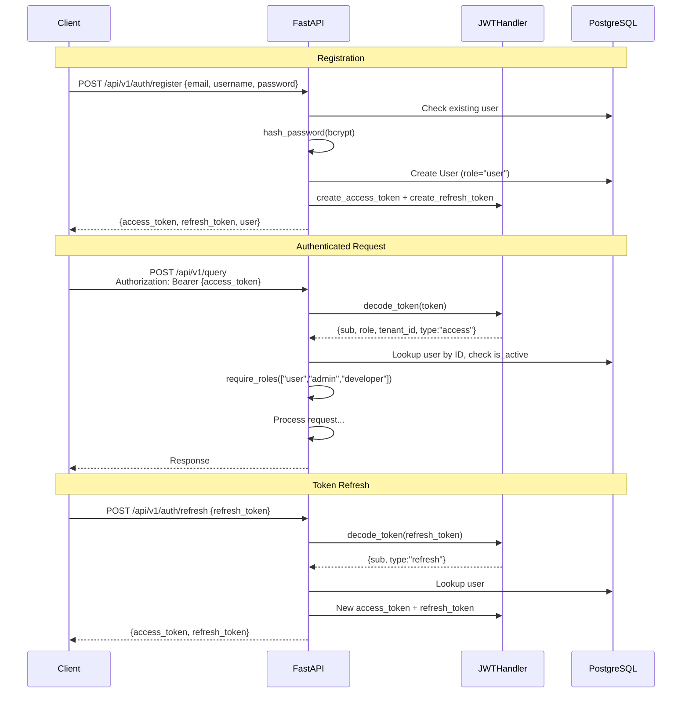

# Architecture

BookStack RAG Agent is a Retrieval-Augmented Generation system that ingests documentation from BookStack and provides an AI-powered Q&A interface.

---

## 1. System Architecture (High Level)



---

## 2. Ingestion Pipeline (Detailed)



---

## 3. RAG Query Pipeline (Detailed)



---

## 4. LangGraph Internal Flow (Node Level)



### Conditional Edges

| From | Condition | Target |
|---|---|---|
| `input` | `state["error"]` is set | → `response` (short-circuit) |
| `input` | No error | → `query_rewrite` |
| `retriever` | No documents or error | → `response` (short-circuit) |
| `retriever` | Documents found | → `reranker` |

### Toggleable Nodes

| Node | Config Toggle | When Disabled |
|---|---|---|
| `input` (guardrails) | `GUARDRAILS_ENABLED` | Skips injection check |
| `query_rewrite` | `QUERY_REWRITER_ENABLED` | Passes original query through |
| `reranker` | `RERANKER_ENABLED` | Uses `NoOpReranker` (pass-through) |
| `context_compressor` | `CONTEXT_COMPRESSION_ENABLED` | Passes reranked docs through |
| `response_validator` | `GUARDRAILS_ENABLED` | Skips grounding validation |

---

## 5. Module-Level Architecture



---

## 6. Database Schema



---

## 7. Database + Vector Store Interaction



---

## 8. Combined End-to-End Flow



---

## 9. Retrieval Strategy Detail



---

## 10. Authentication & Authorization Flow



---

## Directory Structure

```
backend/
├── main.py                 # FastAPI app entry point
├── config.py               # Environment-based settings (pydantic-settings)
├── alembic/                # Database migrations
├── app/
│   ├── api/                # Route handlers
│   │   ├── auth_routes.py         # Login, register, refresh, me
│   │   ├── query_routes.py        # Query + streaming
│   │   ├── ingestion_routes.py    # Ingest, status, documents, books
│   │   ├── admin_routes.py        # Metrics, users, cache
│   │   └── health_routes.py       # Health + detailed checks
│   ├── agents/             # LangGraph pipeline
│   │   ├── graph.py        # Graph build, run_agent_query, stream_agent_query
│   │   ├── nodes.py        # 8 node implementations (AgentNodes class)
│   │   └── state.py        # AgentState TypedDict
│   ├── auth/               # JWT authentication
│   │   ├── jwt_handler.py  # Token create/decode (python-jose)
│   │   ├── dependencies.py # get_current_user, require_roles
│   │   └── password.py     # Bcrypt hash/verify
│   ├── core/               # Cross-cutting concerns
│   │   ├── middleware.py   # Request ID, timing, logging
│   │   ├── cache.py        # InMemoryCache (TTLCache)
│   │   ├── guardrails.py   # Injection detection, grounding validation
│   │   └── logging_config.py
│   ├── db/                 # Data layer
│   │   ├── models.py       # 9 SQLAlchemy models
│   │   ├── session.py      # Async engine + session factory
│   │   └── seed.py         # Default roles + admin user
│   ├── ingestion/          # Content pipeline
│   │   ├── pipeline.py     # IngestionPipeline orchestrator
│   │   ├── bookstack_client.py  # BookStack API client (httpx)
│   │   ├── content_parser.py    # HTML→text, normalize, hash
│   │   └── chunker.py          # Header/paragraph/sentence chunking
│   ├── providers/          # Pluggable backends
│   │   ├── factory.py      # Singleton factories (get_llm, get_embedding, etc.)
│   │   ├── base.py         # Abstract interfaces
│   │   ├── llm/            # OpenAICompatibleLLM, OllamaLLM
│   │   ├── embeddings/     # LocalEmbedding (SentenceTransformers)
│   │   ├── rerankers/      # CrossEncoderReranker
│   │   └── retrievers/     # Dense, Keyword, Hybrid + RRF merge
│   ├── retrieval/          # Vector store
│   │   └── vector_store.py # VectorStoreManager (Qdrant client)
│   └── schemas/            # Pydantic request/response models
```

---

## Key Design Decisions

1. **Single vector store (Qdrant)** — no FAISS/PGVector abstraction overhead
2. **Local embeddings** — SentenceTransformers (BAAI/bge-base-en-v1.5), no external API calls
3. **Flexible LLM** — supports OpenAI, Groq, OpenRouter, Ollama via single `LLM_PROVIDER` config
4. **In-memory cache** — TTL-based caching without Redis dependency
5. **Synchronous ingestion** — FastAPI `BackgroundTasks`, no Celery/Redis
6. **Toggleable pipeline nodes** — every non-essential node can be disabled via env var
7. **Hybrid retrieval** — Dense + keyword search with Reciprocal Rank Fusion
