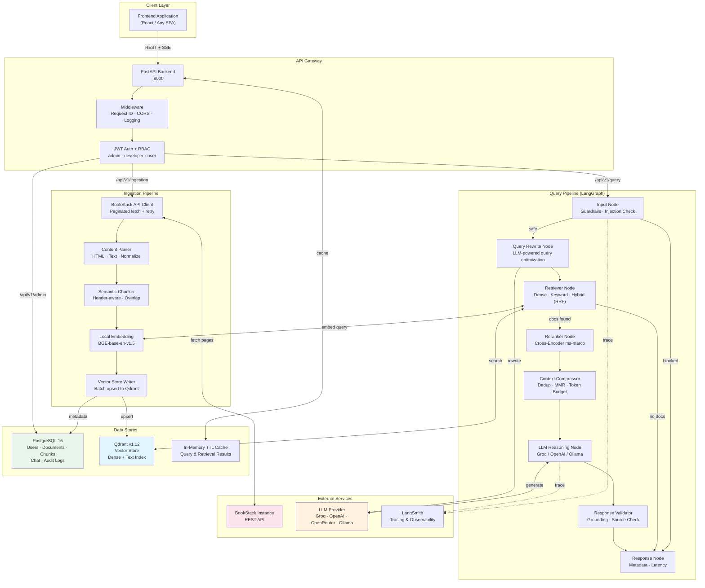
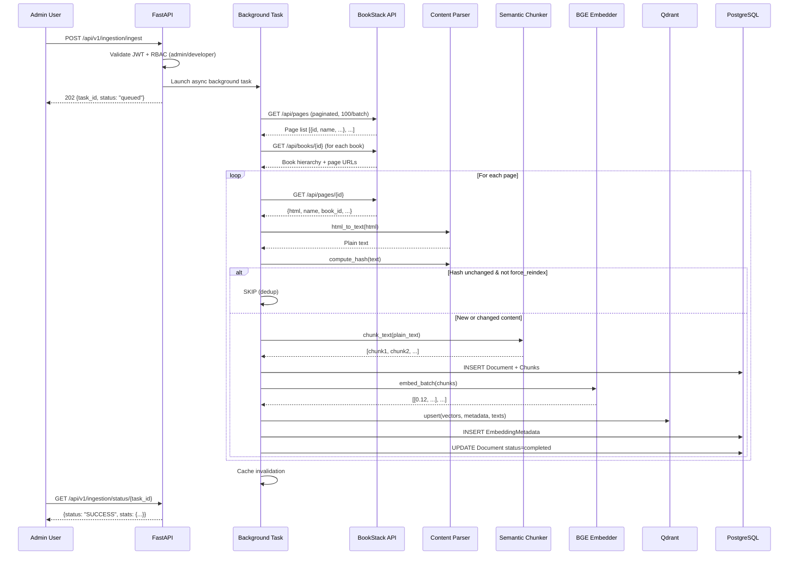
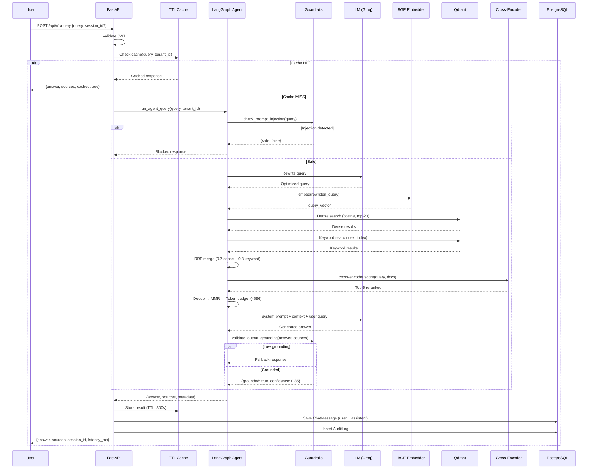

# BookStack RAG Agent — Technical Design Document

> **Version:** 1.0 &nbsp;|&nbsp; **Date:** March 2026 &nbsp;|&nbsp; **Status:** Review-Ready

---

## 1. Project Overview

### Problem Statement

Organizations using **BookStack** as their knowledge management platform face a critical challenge: as documentation volume grows, finding precise answers across hundreds of pages becomes slow and unreliable. Traditional keyword search fails to understand intent, returns irrelevant results, and forces users to manually read through lengthy documents.

### Solution

**BookStack RAG Agent** is an intelligent Retrieval-Augmented Generation (RAG) system that connects to a BookStack instance, ingests its entire documentation corpus, and provides a conversational AI interface that answers questions with cited sources directly from the organization's knowledge base.

### Key Features

- **Automated Ingestion Pipeline** — Fetches, parses, chunks, embeds, and indexes all BookStack pages into a vector database with content-hash deduplication for incremental updates
- **Hybrid Retrieval** — Combines dense vector search with keyword (BM25-style) search via Reciprocal Rank Fusion (RRF) for best-of-both-worlds recall
- **LangGraph Agent Pipeline** — Multi-stage configurable workflow: guardrails → query rewriting → retrieval → reranking → context compression → LLM reasoning → response validation
- **Cross-Encoder Reranking** — Precision-focused reranking of retrieved chunks using a transformer-based cross-encoder
- **Hallucination Guardrails** — Input prompt-injection detection and output grounding validation to ensure answers are faithful to source documents
- **Multi-Tenant RBAC** — JWT-based authentication with role-based access control (admin / developer / user) and tenant isolation
- **Streaming Responses** — Server-Sent Events (SSE) for real-time token streaming
- **Chat History** — Persistent conversation sessions with full message and source tracking
- **Provider-Agnostic LLM** — Pluggable LLM backend supporting Groq, OpenAI, OpenRouter, and Ollama (local inference)
- **Admin Dashboard API** — System metrics, user management, document status, and cache health endpoints

---

## 2. Architecture Overview

### System Design

The system follows a **modular, provider-agnostic architecture** with clear separation between ingestion (write path) and query (read path). All components are pluggable via a factory pattern and configurable through environment variables without code changes.

The backend is a single **FastAPI** application deployed via Docker Compose alongside PostgreSQL (relational metadata), Qdrant (vector store), and optionally Redis (currently replaced by in-memory cache). The query pipeline is orchestrated as a **LangGraph state machine** with conditional edges for graceful degradation.

### Architecture Diagram



---

## 3. Detailed Component Breakdown

### 3.1 Backend Services (FastAPI)

| Component | File | Purpose |
|-----------|------|---------|
| **App Entrypoint** | `main.py` | FastAPI app factory, lifespan (migrations + seeding), middleware registration |
| **Configuration** | `config.py` | Pydantic `BaseSettings` with 50+ env vars, provider auto-resolution, validation |
| **Request Middleware** | `app/core/middleware.py` | UUID request IDs, response time tracking, structured logging |
| **Exception Handler** | `app/core/exceptions.py` | Global catch-all returning sanitized 500 responses |

**API Routes:**

| Router | Prefix | Auth | Description |
|--------|--------|------|-------------|
| Health | `/health` | None | Basic + detailed health checks (cache, vector store) |
| Auth | `/api/v1/auth` | Public | Login, register, token refresh |
| Query | `/api/v1/query` | User+ | RAG query (sync + SSE streaming), chat history |
| Ingestion | `/api/v1/ingestion` | Admin/Dev | Trigger ingestion, status polling, document listing, book hierarchy |
| Admin | `/api/v1/admin` | Admin | System metrics, user management, cache health |

### 3.2 LangGraph Workflow (`app/agents/`)

The query pipeline is implemented as a **LangGraph `StateGraph`** — a directed acyclic graph where each node transforms a shared `AgentState` (TypedDict). Every optional stage respects its environment toggle and fails gracefully.

**`AgentState` Fields:**

| Field | Type | Description |
|-------|------|-------------|
| `query` | `str` | Raw user query |
| `rewritten_query` | `Optional[str]` | LLM-optimized search query |
| `tenant_id` | `str` | Multi-tenant isolation key |
| `session_id` | `Optional[str]` | Chat session continuity |
| `messages` | `List[BaseMessage]` | LangChain message accumulator |
| `retrieved_documents` | `List[dict]` | Raw retrieval results |
| `reranked_documents` | `List[dict]` | Cross-encoder scored results |
| `compressed_documents` | `List[dict]` | Token-budget-trimmed context |
| `answer` | `str` | Final generated answer |
| `sources` | `List[dict]` | Citation metadata |
| `validation_result` | `Optional[dict]` | Grounding check output |
| `error` | `Optional[str]` | Error propagation |
| `metadata` | `dict` | Trace IDs, latency, module status |

**Graph Flow:**

```
Input → [is_blocked?]
  ├─ YES → Response → END
  └─ NO  → QueryRewrite → Retriever → [has_documents?]
                                          ├─ NO  → Response → END
                                          └─ YES → Reranker → ContextCompressor
                                                    → LLM Reasoning → ResponseValidator
                                                    → Response → END
```

**Node Descriptions:**

| Node | Toggle | Behavior |
|------|--------|----------|
| **Input** | `GUARDRAILS_ENABLED` | Validates query, checks for prompt injection using regex pattern matching |
| **QueryRewrite** | `QUERY_REWRITER_ENABLED` | Uses LLM to reformulate ambiguous queries for better retrieval |
| **Retriever** | `RETRIEVAL_MODE` | Executes dense, keyword, or hybrid search against Qdrant |
| **Reranker** | `RERANKER_ENABLED` | Cross-encoder scoring, falls back to top-K passthrough on failure |
| **ContextCompressor** | `CONTEXT_COMPRESSION_ENABLED` | Deduplication → MMR diversity selection → token budget trimming |
| **LLM Reasoning** | Always on | Constructs system prompt with numbered context, invokes LLM |
| **ResponseValidator** | `GUARDRAILS_ENABLED` | Validates answer grounding against source text via word overlap |
| **Response** | Always on | Attaches latency, module summary, trace metadata |

### 3.3 Vector Database (Qdrant)

- **Version:** Qdrant v1.12.4
- **Collection:** `bookstack_documents` (configurable)
- **Vector Size:** 768 dimensions (BGE-base)
- **Distance Metric:** Cosine similarity
- **Indexes:**
  - Dense vector index (default HNSW)
  - Full-text index on `text` payload field (word tokenizer, min 2 / max 20 chars, lowercase)
  - Keyword index on `tenant_id` for multi-tenant filtering
- **Payload stored per point:** `text`, `document_id`, `chunk_index`, `title`, `tenant_id`, `book_id`, `book_name`, `chapter_id`, `source_url`
- **Batch upsert** with retry logic (3 attempts, exponential backoff)
- **Singleton pattern** with thread-safe lazy initialization

### 3.4 Embedding Pipeline

| Aspect | Implementation |
|--------|----------------|
| **Model** | `BAAI/bge-base-en-v1.5` (768-dim, loaded locally via SentenceTransformers) |
| **Batch Size** | 32 |
| **Normalization** | L2-normalized embeddings |
| **Caching** | LRU cache (10,000 entries) keyed by MD5 hash of text |
| **Provider** | `LocalEmbedding` — no external API calls, runs on CPU/GPU |

### 3.5 LLM Integration

The system uses a **factory pattern** (`get_llm()`) to instantiate the configured provider as a singleton:

| Provider | Class | Base URL | Notes |
|----------|-------|----------|-------|
| **Groq** (default) | `OpenAICompatibleLLM` | `https://api.groq.com/openai/v1` | Fast inference, `llama-3.3-70b-versatile` |
| **OpenAI** | `OpenAICompatibleLLM` | `https://api.openai.com/v1` | GPT-4o, GPT-3.5 |
| **OpenRouter** | `OpenAICompatibleLLM` | `https://openrouter.ai/api/v1` | Multi-model gateway |
| **Ollama** | `OllamaLLM` | `http://localhost:11434/v1` | Local inference, no API key |

All providers wrap `langchain_openai.ChatOpenAI` and expose both async (`ainvoke`/`astream`) and sync (`invoke`) interfaces. LangGraph nodes use the synchronous `langchain_client` property for direct invocation within the graph's execution model.

### 3.6 Data Storage (PostgreSQL)

**Database Schema (10 tables):**

```
┌─────────────┐     ┌──────────────┐     ┌───────────────────┐
│   roles      │────<│    users      │────<│   audit_logs      │
│              │     │              │     │                   │
│ id (PK)      │     │ id (PK)      │     │ user_id (FK)      │
│ name         │     │ role_id (FK) │     │ action            │
│ description  │     │ tenant_id    │     │ resource          │
└──────┬───────┘     │ email        │     │ tenant_id         │
       │             │ hashed_pwd   │     └───────────────────┘
       v             └──────┬───────┘
┌─────────────┐            │
│ permissions  │            v
│ role_id (FK) │     ┌──────────────┐     ┌───────────────────┐
│ resource     │     │chat_sessions │────<│  chat_messages     │
│ action       │     │ user_id (FK) │     │ session_id (FK)    │
└─────────────┘     │ tenant_id    │     │ role · content     │
                     └──────────────┘     │ sources (JSONB)    │
                                          └───────────────────┘

┌──────────────┐     ┌──────────────┐     ┌────────────────────┐
│  documents    │────<│    chunks     │────<│embeddings_metadata │
│              │     │              │     │                    │
│ bookstack_id │     │ document_id  │     │ chunk_id (FK)      │
│ content_hash │     │ chunk_index  │     │ vector_store_id    │
│ tenant_id    │     │ content      │     │ model_name         │
│ book_id      │     │ content_hash │     │ dimension          │
│ chapter_id   │     │ metadata(J)  │     └────────────────────┘
│ status       │     └──────────────┘
└──────────────┘

┌──────────────────┐
│ ingestion_runs   │
│ run_id (PK auto) │
│ status           │
│ processed_pages  │
│ failed_pages     │
└──────────────────┘
```

**Key design choices:**
- UUIDs as primary keys for distributed-friendliness
- `tenant_id` indexed on every user-facing table for multi-tenant isolation
- Composite unique constraint on `(bookstack_id, bookstack_type, tenant_id)` for idempotent ingestion
- JSONB columns for flexible metadata and source citations
- Cascade deletes from Document → Chunk → EmbeddingMetadata for clean re-ingestion
- Alembic for migration management, auto-run on startup

---

## 4. End-to-End Flows

### 4.1 Data Ingestion Flow



**Deduplication Strategy:**
1. SHA-256 content hash computed on normalized plain text
2. If document exists with same hash → skip (unless `force_reindex=true`)
3. If hash changed → delete old chunks & embeddings → re-ingest

### 4.2 Query & Retrieval Flow



### 4.3 Response Generation Details

1. **Context Construction:** Reranked/compressed documents are formatted as numbered entries: `[1] Title\nContent`
2. **System Prompt:** Instructs the LLM to answer using ONLY the provided context, cite document titles, and state when information is unavailable
3. **Source Citations:** Each source includes `chunk_id`, `document_title`, `content` (truncated to 500 chars), `score`, and `source_url` (direct link back to BookStack page)
4. **Validation:** Word-overlap analysis between answer and source texts — if confidence < `HALLUCINATION_THRESHOLD` (0.5), a fallback response is returned

---

## 5. Design Decisions

### 5.1 Why LangGraph instead of LangChain Chains or Agents?

| Factor | LangGraph | LangChain LCEL Chains | LangChain Agents (ReAct) |
|--------|-----------|----------------------|-------------------------|
| **Conditional branching** | Native conditional edges (`is_blocked`, `has_documents`) | Requires custom `RunnableBranch` | Tool-based, unpredictable routing |
| **State management** | Explicit `TypedDict` state — typed, inspectable, debuggable | Implicit data flow through pipes | Agent manages state opaquely |
| **Failure isolation** | Each node can fail gracefully without crashing the pipeline | Chain breaks on any error | Entire agent fails |
| **Toggle-ability** | Nodes can be skipped via env config without graph changes | Requires rebuilding the chain | Not applicable |
| **Streaming** | Built-in `astream()` yields per-node events | Limited streaming support | Streaming only on final output |
| **Observability** | LangSmith `@traceable` per node, full state at each step | Trace per chain step | High-level trace only |

**Decision rationale:** The RAG pipeline has 8 stages, several of which are optional and can fail independently. LangGraph's state machine model makes conditional routing explicit (e.g., skip reranker; skip to response if no documents found) and provides node-level tracing. This is important because RAG systems require visibility into which stage dropped or transformed the context.

### 5.2 Why Qdrant as Vector Database?

| Factor | Qdrant | Pinecone | Weaviate | ChromaDB |
|--------|--------|----------|----------|----------|
| **Self-hosted** | Yes (Docker) | No (SaaS only) | Yes | Yes |
| **Hybrid search** | Dense + full-text index (native) | Dense only (metadata filters) | Dense + BM25 (native) | Dense only |
| **Performance** | Rust-based, HNSW, high throughput | Managed, unknown internals | Java/Go, good | Python, not for production |
| **Payload storage** | Stores text alongside vectors | Metadata only (40KB limit) | Stores objects | Limited metadata |
| **Filtering** | Efficient payload filters | Metadata filters | GraphQL filters | Basic filters |
| **Cost** | Free (self-hosted) | Pay per query/vector | Free (self-hosted) | Free |

**Decision rationale:** The system needs hybrid search (dense + keyword) in a single store without managing two separate systems. Qdrant's native text index enables full-text search over stored payloads, and the Rust engine handles high throughput. Self-hosting via Docker keeps data on-premises — critical for organizations whose BookStack may contain sensitive internal documentation.

### 5.3 Why Groq / OpenAI-Compatible LLM Architecture?

- **Default: Groq** with `llama-3.3-70b-versatile` — Groq's custom LPU hardware delivers extremely fast inference (sub-second for most queries), making the RAG pipeline feel instantaneous
- **Architecture: OpenAI-compatible API wrapper** — All four providers (Groq, OpenAI, OpenRouter, Ollama) use the same `ChatOpenAI` LangChain client with different base URLs. Switching providers requires only changing two environment variables (`LLM_PROVIDER`, `LLM_API_KEY`)
- **Why not direct Ollama integration?** The Ollama provider also uses the OpenAI-compatible API (`/v1` endpoint) to keep the abstraction uniform and avoid maintaining two different client implementations
- **Fallback flexibility:** OpenRouter provides access to 100+ models (Claude, Gemini, Mistral, etc.) through a single API key, enabling rapid experimentation

### 5.4 Why This Chunking Strategy?

The `SemanticChunker` uses a **three-tier splitting strategy:**

1. **Header-aware splitting** — First attempts to split on markdown headers (`# H1`, `## H2`, etc.) to preserve section-level semantics
2. **Paragraph merging** — If no headers, splits on double newlines and merges small paragraphs up to `CHUNK_SIZE` (512 chars default)
3. **Sentence-level overlap** — For oversized sections, splits at sentence boundaries with configurable overlap (50 chars default)

**Why 512 token chunks?** This balances retrieval precision (smaller chunks = more specific matches) against context completeness (larger chunks = more surrounding information). The cross-encoder reranker compensates for the precision loss of larger chunks, and the context compressor removes redundancy before sending to the LLM.

### 5.5 Why Hybrid Retrieval with RRF?

- **Dense-only** misses lexical matches (exact terms, proper nouns, error codes)
- **Keyword-only** misses semantic similarity (synonyms, paraphrases)
- **Reciprocal Rank Fusion (RRF)** merges both ranked lists with configurable weights (`DENSE_WEIGHT=0.7`, `BM25_WEIGHT=0.3`), normalized to [0,1]
- RRF is parameter-free (just the `k=60` constant) and doesn't require score calibration between different retrieval methods

### 5.6 Why Local Embeddings Instead of API-Based?

- **Latency:** Embedding is called on every query AND during batch ingestion. Local models eliminate network round-trips (critical for embedding 500+ chunks in one ingestion run)
- **Cost:** No per-token embedding charges. BGE-base-en-v1.5 is open-source and runs on CPU
- **Privacy:** Document text never leaves the infrastructure
- **Quality:** BGE-base ranks in the top tier on MTEB benchmarks for its size class (768-dim)

---

## 6. Trade-offs & Alternatives

### 6.1 Current Trade-offs

| Decision | Trade-off | Mitigation |
|----------|-----------|------------|
| **In-memory cache** (not Redis) | Lost on restart, no shared cache across workers | Acceptable for single-instance deployment; Redis integration easy to swap back |
| **Background task** (FastAPI `BackgroundTasks`) | No persistent task queue; tasks lost on crash | In-memory `_ingestion_tasks` dict tracks status. For production: swap to Celery + Redis/RabbitMQ |
| **Synchronous LangGraph nodes** | LLM calls in nodes use `.invoke()` not `await .ainvoke()` | LangGraph's execution model runs nodes synchronously; async would require custom executors |
| **Word-overlap grounding check** | Crude hallucination detection (not semantic) | Sufficient for first pass; can be upgraded to NLI-based entailment model |
| **Single embedding model** | No model-specific optimization for different content types | BGE-base is general-purpose; specialized models can be swapped via config |

### 6.2 Alternatives Not Chosen

| Alternative | Why Not Chosen |
|-------------|---------------|
| **LlamaIndex** | Tightly coupled index abstractions; less control over individual pipeline stages. LangGraph provides node-level control needed for conditional logic and streaming |
| **Pinecone** | SaaS-only, no self-hosting, per-query pricing. Organization's data stays on-premises with Qdrant |
| **pgvector** | Good for simple use cases, but lacks native hybrid search (text index). Qdrant's dedicated vector engine offers better performance at scale |
| **RAG Fusion** | Generates N query variants + retrieves N times. Higher latency and LLM cost for marginal recall improvement. Single query rewrite + hybrid retrieval achieves similar results |
| **Celery Workers** | Adds Redis + worker process complexity. FastAPI BackgroundTasks is sufficient for current scale (single-node deployment) |
| **Fine-tuned Embedding Model** | Requires labeled query-document pairs from the BookStack corpus, significant training pipeline. BGE-base generalizes well out of the box |

---

## 7. Scalability & Performance

### 7.1 Current Performance Profile

| Operation | Expected Latency | Bottleneck |
|-----------|-----------------|------------|
| Query (cached) | ~5ms | Cache lookup |
| Query (full pipeline) | 2–5s | LLM generation (~70%), embedding (~10%), retrieval (~10%), reranking (~10%) |
| Ingestion (per page) | 1–3s | Embedding batch (CPU-bound) |
| Full ingestion (100 pages) | 2–5 min | Sequential page processing |

### 7.2 Scaling Strategies

| Bottleneck | Scale Strategy |
|------------|---------------|
| **LLM latency** | Groq already optimizes (LPU hardware). For self-hosted: vLLM with GPU batching |
| **Embedding throughput** | Move to GPU inference, increase batch size. Or switch to API-based embeddings (OpenAI ada-002) for horizontal scale |
| **Qdrant search** | Qdrant scales horizontally via sharding + replication. Current single-node handles millions of vectors |
| **PostgreSQL** | Connection pooling (already configured: 20 pool, 10 overflow). Read replicas if needed |
| **Concurrent queries** | Uvicorn workers + async I/O. Cache layer absorbs repeated queries |
| **Ingestion parallelism** | Current: sequential per-page. Improvement: asyncio.gather for page fetching, parallel embedding batches |

### 7.3 Current Limits

- **Single-process ingestion:** No parallel page processing
- **In-memory cache:** Limited to ~1000 entries, lost on restart
- **No GPU requirement:** Embedding runs on CPU — suitable for dev/small-scale, but will bottleneck at 10K+ pages
- **No rate limiting:** API endpoints lack rate limiting (rely on upstream proxy)

---

## 8. Review Questions & Answers

### Architecture Questions

**Q1: Why not use a simple prompt-stuffing approach instead of this multi-stage pipeline?**

Prompt-stuffing (dump all context into one LLM prompt) fails at scale because: (1) context window limits cap at 128K tokens, while a BookStack instance may have millions of tokens; (2) retrieval precision drops when irrelevant content dilutes the context; (3) no source tracing possible. The multi-stage pipeline first narrows to the 5 most relevant chunks (from potentially thousands), then generates from high-quality, verified context.

**Q2: What happens if the LLM service goes down?**

The `llm_reasoning_node` catches all exceptions and returns a graceful fallback message: *"I'm temporarily unable to generate a response. Please try again later."* The pipeline still returns sources, so the user can manually read relevant documents. The error is logged and traceable via LangSmith.

**Q3: How does the system handle conflicting information across different BookStack pages?**

The MMR (Maximal Marginal Relevance) selection in the context compressor explicitly promotes diversity — it penalizes chunks that are too similar to already-selected ones. This ensures the LLM sees different perspectives. The system prompt instructs the LLM to cite specific document titles, so conflicting information is surfaced with attribution.

**Q4: Why are LangGraph nodes synchronous if FastAPI is async?**

LangGraph's `StateGraph` executes nodes in a synchronous context by design. The `ainvoke()` method on the compiled graph handles the async-to-sync bridge. This is intentional — LangGraph manages its own execution lifecycle. The LLM calls within nodes use `langchain_client.invoke()` (sync), which is correct for this execution model. The outer FastAPI handler remains fully async.

### Technology Choice Challenges

**Q5: If you switch from Groq to a slower LLM provider, how does that impact user experience?**

The critical path latency is dominated by LLM generation. Switching from Groq (~300ms) to OpenAI (~2s) or Ollama (~5-10s for 70B) would increase query latency proportionally. Mitigations: (1) SSE streaming delivers tokens as they appear, improving perceived latency; (2) the cache layer absorbs repeated queries; (3) the query rewriter can be disabled to save one LLM round-trip.

**Q6: Why use BGE-base-en-v1.5 specifically?**

BGE-base-en-v1.5 scores in the top tier on MTEB (Massive Text Embedding Benchmark) for models under 1B parameters. It produces 768-dim vectors — a good balance between quality and storage. Larger models (e.g., BGE-large, 1024-dim) offer marginal quality improvement at 2x compute cost. The model is also instruction-tuned for retrieval tasks specifically.

**Q7: What if Qdrant loses data?**

Qdrant persists to a Docker volume (`qdrant_data`). However, if data is lost, the system can fully recover by re-running ingestion (`force_reindex=true`). The source of truth is BookStack itself, and the PostgreSQL `documents` table tracks what's been ingested. The ingestion pipeline is fully idempotent.

### Edge Cases

**Q8: How does the system handle very long BookStack pages (50K+ characters)?**

The semantic chunker splits oversized sections at sentence boundaries with 50-character overlap. A 50K-character page would produce ~100 chunks (at 512 chars each). All chunks are embedded and indexed. During retrieval, only the most relevant chunks are returned — the page size doesn't affect query latency.

**Q9: What happens when a user asks a question that has no answer in the documentation?**

1. The retriever returns 0 documents (or below `SIMILARITY_THRESHOLD=0.3`)
2. The conditional edge routes directly to the Response node, skipping reranking and LLM
3. The system returns an empty answer with 0 sources
4. If documents are found but grounding validation fails (<50% word overlap), the ResponseValidator returns a safe fallback message

**Q10: How does the system handle multilingual BookStack content?**

BGE-base-en-v1.5 is optimized for English. Multilingual content may produce lower-quality embeddings. The keyword search component (BM25) works in any language with word tokenization. For multilingual support, replace the embedding model with a multilingual variant (e.g., `BAAI/bge-m3`) by changing one environment variable.

### Security Questions

**Q11: How is prompt injection prevented?**

Two layers: (1) **Input guardrails** use 12 regex patterns detecting known injection templates ("ignore previous instructions", "[system]", etc.); (2) **Output validation** checks that the answer is grounded in source documents via word overlap analysis. Neither is bulletproof — a determined adversary could craft novel injections. For production: consider an LLM-based classifier as an additional layer.

**Q12: How are BookStack API credentials protected?**

Credentials (`BOOKSTACK_TOKEN_ID`, `BOOKSTACK_TOKEN_SECRET`) are stored in `.env` files, never hardcoded. In Docker, the `env_file` directive maps the `.env` to the container. The credentials are sent via HTTP `Authorization` header. For production: use a secrets manager (Vault, AWS Secrets Manager) and rotate tokens.

**Q13: Is there tenant data isolation?**

Yes. Every database query and Qdrant search is filtered by `tenant_id`. The JWT token embeds the user's `tenant_id`, and all API handlers extract it via the `CurrentUser` dependency. Cross-tenant access is not possible through the API layer. However, the Qdrant text index is shared — a future improvement would be per-tenant collections.

### Cost Considerations

**Q14: What are the running costs?**

| Component | Self-Hosted Cost | Cloud/API Cost |
|-----------|-----------------|----------------|
| Qdrant | Free (Docker) | Qdrant Cloud: ~$25/mo for 1M vectors |
| PostgreSQL | Free (Docker) | RDS: ~$15/mo (t3.micro) |
| Embeddings | Free (local CPU) | OpenAI ada-002: ~$0.10/1M tokens |
| LLM (Groq) | Free tier: 30 req/min | $0.27/1M tokens (Llama 70B) |
| Compute | Docker host: $10-40/mo (VPS) | — |

**Total estimated cost: $10-40/month self-hosted, $40-80/month cloud.**

### Tough Manager-Level Questions

**Q15: How is this different from just adding ChatGPT to our docs?**

Three critical differences: (1) **Data privacy** — documents never leave your infrastructure; ChatGPT would require sending proprietary docs to OpenAI's API; (2) **Source tracing** — every answer comes with exact page citations and direct links back to BookStack; ChatGPT has no source awareness; (3) **Freshness** — the ingestion pipeline auto-syncs with BookStack using content hashing; ChatGPT's knowledge has a training cutoff.

**Q16: What's the accuracy/reliability of answers?**

The system has multiple accuracy safeguards: (1) Hybrid search (dense + keyword) maximizes recall; (2) Cross-encoder reranking reorders by true semantic relevance; (3) Context compression removes noise; (4) The LLM is constrained to answer ONLY from provided context via system prompt; (5) Grounding validation checks that the answer vocabulary overlaps with sources. However, no RAG system is 100% accurate — the confidence score in metadata lets the frontend display a trust indicator.

**Q17: How long does initial setup take?**

Cold start: `docker compose up -d` provisions all services in ~2 minutes. Ingestion of 100 pages takes ~5 minutes. Total time from zero to first query: **under 10 minutes.** Ongoing syncs are incremental (content-hash deduplication skips unchanged pages).

**Q18: Can this scale to 10,000 pages? 100,000?**

10K pages (~50K chunks, ~50K vectors): Qdrant handles this trivially. Query latency unaffected. Ingestion takes ~8-12 hours (sequential, CPU embedding). At this scale, GPU embeddings and parallel ingestion become necessary.

100K pages: Requires Qdrant sharding, GPU-accelerated embeddings, Celery-based parallel ingestion workers, and possibly distributed embedding across multiple machines.

### Follow-up Cross-Questions

**Q19: You mentioned RRF for hybrid search. Why not learned score fusion?**

Learned fusion requires a labeled dataset of (query, relevant_document) pairs to train a fusion model. RRF is unsupervised — it works out of the box with zero training data. For an internal documentation system where we don't have relevance labels, this is the pragmatic choice.

**Q20: The grounding check uses word overlap. Isn't that easily fooled?**

Yes — it's a heuristic, not a proof of factuality. An answer could rephrase source content using different words and fail the check (false negative), or contain source words in a misleading arrangement (false positive). The `HALLUCINATION_THRESHOLD=0.5` is conservative. For production, replace with an NLI (Natural Language Inference) model like `facebook/bart-large-mnli` that checks logical entailment.

**Q21: Why not use conversation memory / multi-turn context?**

The current implementation creates chat sessions and stores message history, but the LangGraph pipeline processes each query independently. Adding conversation memory requires: (1) passing the last N messages into the LLM context; (2) conditioning the retriever on conversation context. This is a planned improvement — the `session_id` and `messages` fields in `AgentState` are already wired for it.

---

## 9. Improvements & Future Roadmap

### Short-Term (1-3 months)

| Improvement | Impact | Effort |
|-------------|--------|--------|
| **Multi-turn conversation memory** | Higher quality follow-up answers | Medium — wire chat history into LLM context |
| **Parallel ingestion** | 5-10x faster ingestion for large BookStack instances | Low — `asyncio.gather` for page fetching + parallel embedding |
| **GPU embedding inference** | 10-20x faster embedding generation | Low — configure CUDA in Docker |
| **Redis cache** | Persistent, shared cache across workers | Low — swap `InMemoryCache` for Redis client |
| **Rate limiting** | API abuse prevention | Low — FastAPI middleware + token bucket |
| **Webhook-based sync** | Auto-ingest when BookStack pages change | Medium — BookStack webhook API + event handler |

### Long-Term (3-12 months)

| Improvement | Impact | Effort |
|-------------|--------|--------|
| **NLI-based hallucination detection** | More accurate grounding validation | Medium — integrate BART-MNLI or similar |
| **Per-tenant Qdrant collections** | Stronger data isolation at vector level | Medium — dynamic collection management |
| **Evaluation framework** | Automated quality metrics (Ragas, DeepEval) | Medium — E2E evaluation pipeline |
| **Admin dashboard frontend** | Visual management of documents, metrics, users | High — React application |
| **Multi-language support** | Non-English BookStack instances | Low — swap to multilingual embedding model |
| **Document-level permissions** | Respect BookStack's per-page/book permissions in retrieval | High — sync permission metadata, filter at query time |

### Production Readiness Gaps

| Gap | Severity | Remediation |
|-----|----------|-------------|
| **No rate limiting on API** | High | Add `slowapi` or NGINX-level rate limiting |
| **Default JWT secret** | Critical | Force `JWT_SECRET_KEY` to be set (reject startup with default) |
| **No health check alerting** | Medium | Integrate with Prometheus/Grafana or PagerDuty |
| **No backup strategy** | High | Automated PostgreSQL + Qdrant volume backups |
| **Single-instance deployment** | Medium | Add horizontal scaling config (multiple Uvicorn workers, load balancer) |
| **No request validation audit** | Medium | Log and flag unusual query patterns (beyond prompt injection) |

### CI/CD & Monitoring Suggestions

- **CI:** GitHub Actions → lint (`ruff`) → type check (`mypy`) → unit tests (`pytest`) → integration tests (Docker Compose test profile)
- **CD:** Build Docker image → push to registry → deploy via `docker compose pull && docker compose up -d`
- **Monitoring:** LangSmith for LLM tracing (already integrated), Prometheus metrics endpoint, structured JSON logging for ELK/Loki ingestion
- **Alerting:** Query latency P99 > 10s, ingestion failure rate > 10%, Qdrant health check failures

---

## 10. Risks & Mitigations

### Technical Risks

| Risk | Likelihood | Impact | Mitigation |
|------|-----------|--------|------------|
| **LLM provider outage** (Groq down) | Medium | High — queries fail | Factory pattern enables instant switch to backup provider via env var. Cache serves recent queries |
| **BookStack API rate limiting** | Low | Medium — ingestion slows | Tenacity retry with exponential backoff (3 attempts, 1-10s waits). Respect API rate limits |
| **Embedding model quality degradation on domain-specific content** | Medium | Medium — poor retrieval | Cross-encoder reranker compensates. Can fine-tune embedding model on domain data |
| **Qdrant data corruption** | Low | High — queries fail | Qdrant uses WAL (write-ahead log). Re-ingestion from BookStack (source of truth) restores data |
| **Prompt injection bypassing regex guards** | Medium | Medium — misleading answers | Output grounding validation provides second defense layer. Can add LLM-based classifier |
| **Token budget overflow in LLM context** | Low | Low — truncated context | `_trim_to_token_budget()` enforces hard limit (4096 tokens default). Configurable |

### Operational Risks

| Risk | Likelihood | Impact | Mitigation |
|------|-----------|--------|------------|
| **Docker volume data loss** | Low | High | Automated backup schedule for `pgdata` and `qdrant_data` volumes |
| **Secrets exposure** (`.env` in repo) | Medium | Critical | `.gitignore` must include `.env`. Use secrets manager in production |
| **Memory pressure from embedding models** | Medium | Medium | BGE-base requires ~500MB RAM. Monitor with container memory limits |
| **Concurrent ingestion + query contention** | Low | Medium | Qdrant handles concurrent reads/writes. PostgreSQL connection pool sized at 30 |
| **Dependency vulnerabilities** | Medium | Varies | Dependabot / `pip-audit` in CI. Pin major versions in requirements.txt |

### Business Risks

| Risk | Mitigation |
|------|------------|
| **LLM API cost escalation** | Groq free tier + caching + query dedup. Switch to Ollama for zero-cost local inference |
| **Single-vendor LLM lock-in** | Provider-agnostic factory pattern — switch providers with one env var change |
| **Stale documentation causing wrong answers** | Content-hash deduplication detects changes. Webhook-based sync (roadmap) enables real-time updates |
| **User trust in AI-generated answers** | Source citations with direct BookStack links. Confidence scores in metadata. Fallback messages when grounding is low |

---

*Document generated from codebase analysis. All technical claims are based on actual implementation in the repository.*
